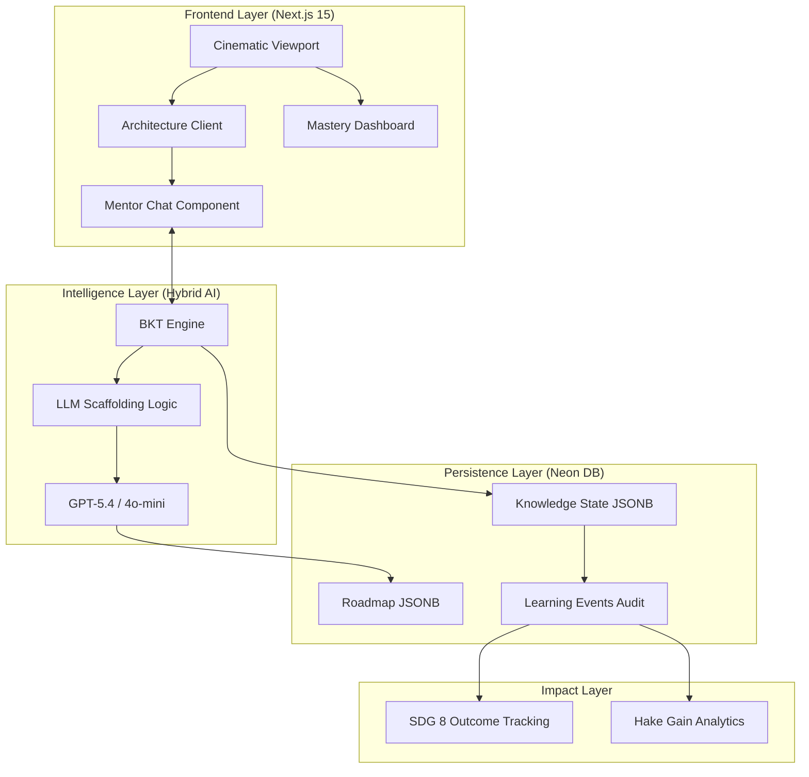

# CareerOrbit

> **Adaptive Learning for the Future Workforce.**  
> A high-fidelity, cognitive-first platform designed to accelerate vocational mastery through a Hybrid LLM + BKT Intelligence Layer.

---

## 🚀 Overview
CareerOrbit is a professional adaptive learning platform that bridges the gap between traditional vocational training and the dynamic demands of the modern gig economy. By fusing **Bayesian Knowledge Tracing (BKT)** with **Large Language Models (LLMs)**, CareerOrbit creates a "Digital Twin" of every learner, ensuring that instruction is always perfectly aligned with their **Zone of Proximal Development (ZPD)**.

---

## 🏛️ System Architecture



---

## 🛠️ Technology Stack

| Layer | Technology |
| :--- | :--- |
| **Framework** | Next.js 15 (App Router, Server Actions) |
| **Language** | TypeScript (Strict Mode) |
| **Database** | Neon Serverless PostgreSQL |
| **ORM** | Drizzle ORM |
| **AI SDK** | Vercel AI SDK (Streaming, Structured Outputs) |
| **Inference** | OpenAI GPT-5.4 (Reasoning), GPT-4o-mini (Instant) |
| **Styling** | Tailwind CSS 4, Framer Motion (Cubic-Bezier Animations) |
| **Analytics** | Vitest (Diagnostic Validation), Hake Gain Models |

---

## 🧠 The Mastery Engine: BKT-First UI
CareerOrbit is built on the **BKT-First** philosophy. Every UI element—from the glowing intensity of a roadmap node to the scaffolding level of the AI mentor—is driven by the real-time probability of mastery ($P(L)$).

### Key Cognitive Parameters:
- **Guess Penalty ($P(G)$):** Prevents luck from inflating mastery.
- **Slip Buffer ($P(S)$):** Protects progress from typos and lapses.
- **Recovery Boost:** Accelerates learning for users demonstrating sudden insights.

---

## 📈 Research & Impact (SDG 8)
CareerOrbit is engineered to track and optimize **UN SDG 8 (Decent Work and Economic Growth)** indicators. 
- **Normalized Learning Gain (NLG):** Scientifically proves educational efficacy.
- **Mastery Telemetry:** Maps cognitive growth to real-world labor market readiness.

---

## 📂 Documentation Registry
For deep-dive technical specifications, refer to the `team-documents/` directory:

1. [Frontend Architecture Guide](team-documents/frontend.md)
2. [Backend & AI Architecture Bible](team-documents/backend.md)
3. [UI/UX Aesthetics & Animation Bible](team-documents/ui-ux.md)
4. [Deployment & Infrastructure Manifest](team-documents/deployment.md)
5. [Database Schema & Persistence Guide](team-documents/database.md)
6. [LLM-Model Registry & Prompt Engineering](team-documents/llm-model.md)
7. [Technical Test Cases & Validation](team-documents/test-cases.md)
8. [The Hybrid LLM + BKT Master Thesis](team-documents/BKT.md)

---

## ⚡ Getting Started

### 1. Prerequisites
- Node.js 20+
- PostgreSQL (Neon recommended)
- OpenAI API Key

### 2. Installation
```bash
git clone https://github.com/your-repo/career-orbit.git
cd career-orbit
npm install
```

### 3. Environment Setup
Create a `.env.local` file:
```env
DATABASE_URL=your_neon_url
OPENAI_API_KEY=your_key
NEXT_PUBLIC_APP_URL=http://localhost:3000
```

### 4. Database Sync
```bash
npx drizzle-kit push
```

### 5. Launch
```bash
npm run dev
```

---

## 🛡️ License & Safety
- **Universal Guardian Rules:** The AI Mentor is strictly locked to vocational topics.
- **Data Isolation:** Enterprise-grade Row-Level Security (RLS) patterns enforced via Drizzle.
