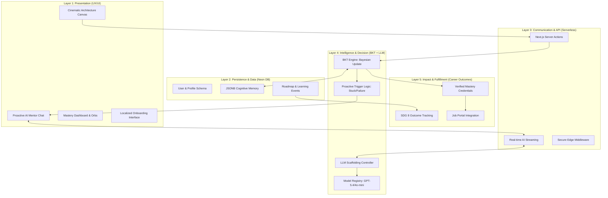
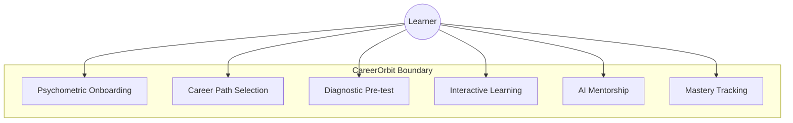
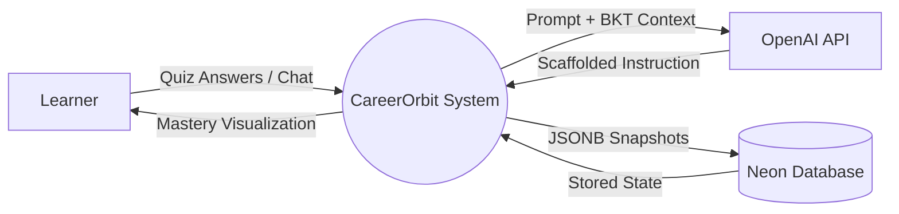
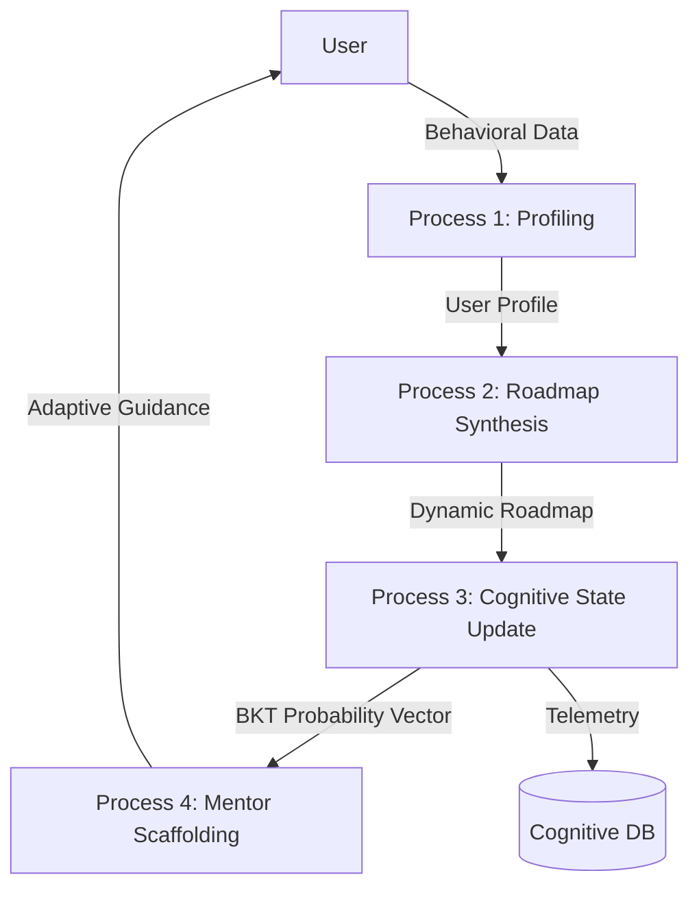
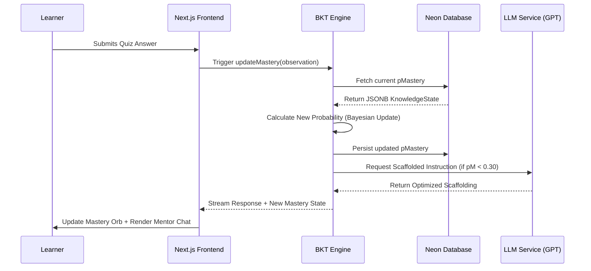
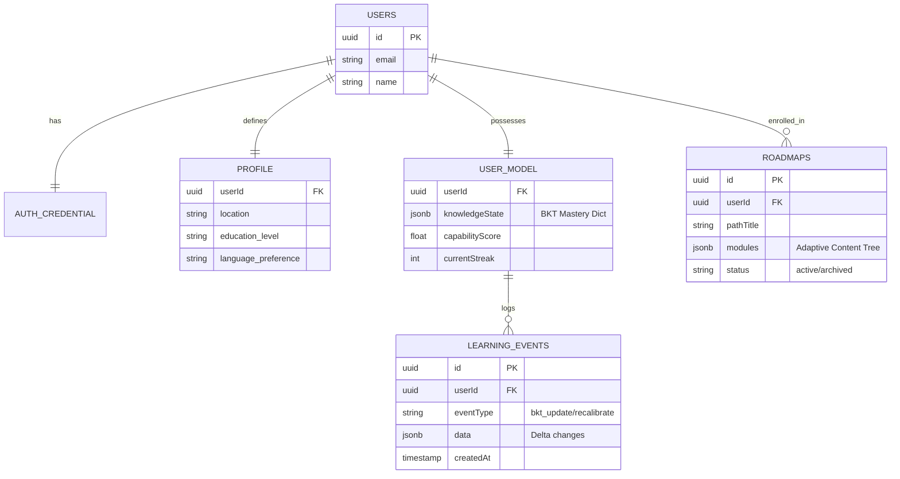

# Chapter 5: PROPOSED SYSTEM

## 5.1 Overview

The proposed system, CareerOrbit, represents a departure from traditional linear learning models by implementing a multi-agent, hybrid intelligence architecture. This chapter details the structural and behavioral design of the platform, utilizing formal modeling techniques to illustrate how data transforms into cognitive insights.

---

## 5.2 High-End Multi-Tiered System Architecture

The CareerOrbit architecture is a five-layer stack designed to ensure pedagogical integrity and industrial scalability. As illustrated in **Fig 5.1**, the system transitions from raw user interactions to verified career outcomes.



**Fig 5.1: High-End Layered System Architecture of the CareerOrbit Ecosystem**

### 5.2.1 Detailed Layer Analysis

#### **Layer 1: Presentation (UX/UI)**

The presentation layer is the primary entry point for the learner. It features a **Cinematic Architecture Canvas** that visualizes the curriculum as an interactive node-graph. The **Proactive AI Mentor** is integrated directly into this layer, utilizing Framer Motion for non-intrusive animations.

#### **Layer 2: Persistence & Data (Neon DB)**

This layer manages the "Digital Twin" of the learner. Unlike traditional databases, we utilize **JSONB Cognitive Memory** to store high-variance mastery probabilities for thousands of subtopics without schema rigidity.

#### **Layer 3: Communication & API**

This layer utilizes **Next.js Server Actions** to ensure zero-latency state updates. The **Real-time AI Streaming** allows the mentor to provide immediate guidance, while the **Secure Edge Middleware** handles authentication and data isolation.

#### **Layer 4: Intelligence & Decision (The Cognitive Brain)**

This is the core of CareerOrbit.

- **BKT Engine:** Performs the recursive Bayesian math to update the $pMastery$ vector.
- **Scaffolding Controller:** Dictates whether the LLM should provide a "Hint," a "Clarification," or a "Full Explanation" based on the BKT state.
- **Proactive Trigger Logic:** Monitors behavioral signals (e.g., idleness or repeated quiz failure) to automatically deploy the AI Mentor.

#### **Layer 5: Impact & Fulfillment (Career Outcomes)**

The final layer connects learning to employment. It maps BKT-verified mastery to **UN SDG 8 metrics** and facilitates a direct pipeline to **Job Portals**. Verified credentials are only generated once the BKT engine confirms the probability of mastery ($P(L)$) exceeds $0.95$.

---

## 5.3 Use Case Modeling

To understand the functional boundaries of the system, we analyze the primary use cases for the learner. As illustrated in **Fig 5.3**, the user interacts with the system through four core lifecycle stages: Discovery, Diagnostics, Learning, and Mentorship.



**Fig 5.3: Use Case Diagram for the CareerOrbit Ecosystem**

- **Discovery (UC1, UC2):** The initial phase where the user defines their vocational intent.
- **Diagnostics (UC3):** The BKT engine initializes the $pMastery$ baseline.
- **Learning (UC4, UC6):** The adaptive loop where mastery is tracked and visualized.
- **Mentorship (UC5):** The proactive support layer that fires during cognitive blockages.

---

## 5.4 Data Flow Analysis

The flow of data within CareerOrbit is characterized by the transformation of raw behavioral signals into refined mastery probabilities.

### 5.4.1 DFD Level 0 (Context Diagram)

**Fig 5.4** illustrates the context diagram, showing CareerOrbit as a central process interacting with external entities like the OpenAI API for reasoning and the Neon Cloud for data persistence.



**Fig 5.4: DFD Level 0 — Context Diagram**

### 5.4.2 DFD Level 1 (Process Decomposition)

In **Fig 5.5**, we decompose the central system into its constituent processes. This diagram highlights the "BKT-LLM Feedback Loop," where the output of the BKT process directly modifies the inputs for the LLM process.



**Fig 5.5: DFD Level 1 — Process Decomposition showing the BKT-LLM feedback loop**

---

## 5.5 Cognitive State Transition Modeling

To mathematically formalize the adaptive behavior of CareerOrbit, we model the Knowledge Component (KC) lifecycle as a **Hidden Markov Model (HMM)**. As illustrated in **Fig 5.6**, the learner exists in one of two hidden states: **Unlearned** or **Learned**.

```mermaid
stateDiagram-v2
    [*] --> Unlearned
    Unlearned --> Unlearned: "1 - P(T)"
    Unlearned --> Learned: "P(T) Transition"
    Learned --> Learned: "1.0 Mastery"
  
    note right of Unlearned: Observation: Correct (Guess) or Incorrect (1-G)
    note right of Learned: Observation: Correct (1-S) or Incorrect (Slip)
```

**Fig 5.6: State Transition Diagram representing the Bayesian Knowledge Tracing HMM**

In **Fig 5.6**, we observe that mastery is treated as a permanent transition. The system's primary task is to use the **Observations** (Correct/Incorrect) to estimate the probability of the user being in the **Learned** state.

- **The Learning Transition ($P(T)$):** Represents the cognitive shift after an instructional intervention (e.g., watching a video).
- **The Persistence Invariant:** Once a user reaches the "Learned" state, the model assumes a probability of $1.0$ for staying in that state, although **Asymptotic Clamping** is applied in the implementation to maintain model responsiveness to "Slips."

---

## 5.6 System Sequence Analysis

The temporal interaction between the system's components is critical for achieving low-latency adaptation. As depicted in the sequence diagram in **Fig 5.7**, the "Adaptive Loop" is a five-stage process involving the client, the serverless engine, the database, and the LLM inference service.



**Fig 5.7: Sequence Diagram of the Real-time Adaptive Learning Loop**

As shown in **Fig 5.7**, the BKT engine acts as the central orchestrator. It ensures that the LLM is only invoked *after* the deterministic state update is performed, ensuring that the guidance provided is always grounded in the most recent evidence of user ability.

---

## 5.7 Entity-Relationship Modeling (ERD)

The structural integrity of the CareerOrbit ecosystem is maintained through a relational schema optimized for both structured and semi-structured (JSONB) data. **Fig 5.8** illustrates the ER Diagram, highlighting the central role of the `user_model` table.



**Fig 5.8: Entity-Relationship Diagram (ERD) for CareerOrbit Cognitive Data Persistence**

### 5.7.1 Data Modeling Rationale

As seen in **Fig 5.8**, we utilize a hybrid storage strategy:

1. **Relational Columns:** Used for high-frequency queries (e.g., `userId`, `status`).
2. **JSONB Columns:** Used for high-variance cognitive data (`knowledgeState`) and hierarchical content (`modules`). This ensures that the schema remains flexible as new vocational paths are added to the system without requiring invasive migrations.

---

## 5.8 Summary

Chapter 5 has provided a comprehensive architectural and behavioral analysis of the CareerOrbit platform. By detailing the high-level architecture (**Fig 5.1**), the process-level data flow (**Fig 5.5**), and the underlying cognitive state machine (**Fig 5.6**), we have demonstrated that the system is not merely a collection of features, but a mathematically consistent learning engine. The structural design depicted in the ERD (**Fig 5.8**) further ensures that the platform is scalable, secure, and research-ready.
